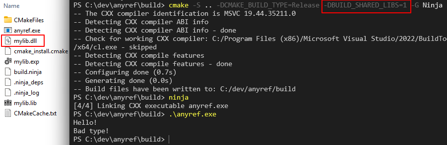
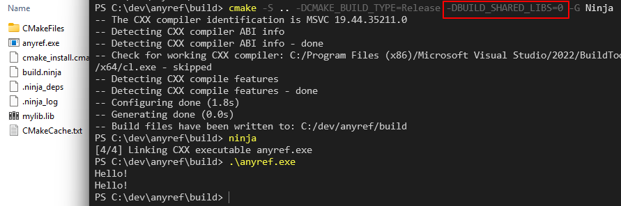
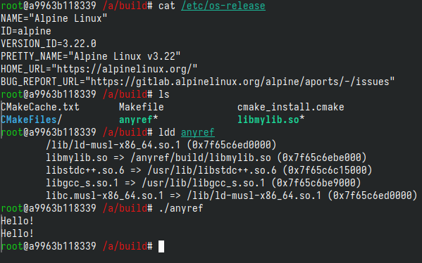

# `std::any` vs `any_ref`
众所周知, `std::any`是一个类型擦除的容器. 相比`void*`的, 它的主要区别就是:
1. `any_cast`会保证类型安全.
2. 有明确的所有权语义, 会自己管理被容纳对象的析构, 拷贝等操作. 而`void*`的所有权语义不明.

## 非所有权的类型擦除引用
如果我们把上述的第二点改为明确的无所有权语义, 那就得到了`any_ref`. 类似于`std::function`和`std::function_ref`的区别.

不过, C++标准库中目前还没有`any_ref`. 在一些第三方库中能见到.

# 实现`any_ref`
`any_ref`的实现要比`std::any`简单很多, 因为不需要管理对象的生命周期, 实际上可以看做是`void*`的一个简单wrapper. 相比之下, `std::any`需要一个类似虚表的结构, 存一些函数指针, 用于析构, 拷贝, move等操作. 一般来说, `any_ref`只需要存一个`void*`指针, 和一个用来辨别类型的变量.

## 无RTTI实现
如果使用RTTI, 那么只需要对比构建时和cast时的`typeid`即可. 但为了性能等原因, 如果不使用RTTI, 能不能实现? 答案是肯定的, 只需要利用`inline`函数或变量*地址的唯一性*.

>An inline function or variable shall be defined in every translation unit in which it is odr-used and shall
have exactly the same definition in every case (6.2). ...... **An
inline function or variable with external linkage shall have the same address in all translation units.**  
-- _C++17 specification n4713, §10.1.6_

例如, 我们可以使用一个`inline`的变量模版, 这个模版若用相同的模板类型实参单态化, 即使是在不同的编译单元(TU)内, 产生的变量也会具有相同的指针地址.
反之, 如果用不同的类型单态化, 变量地址也会不同. 利用这一点就能实现`any_ref`cast时的类型验证.

这里直接给出一个简单的实现:
```c++
#include <stdexcept>
#include <type_traits>

namespace detail {

template<typename T>
inline int any_ref_helper{};

} // namespace detail

class AnyRef {
public:
    template<typename T,
             // Prevent shadowing the copy constructor
             typename = std::enable_if_t<!std::is_same_v<AnyRef, std::remove_cv_t<T>>>
             >
    AnyRef(T& val) noexcept : data_(const_cast<void*>(static_cast<const void*>(&val))),
    type_ptr_(&detail::any_ref_helper<T>)
    {}

    template<typename T>
    T& cast() const {
        const auto pT = &detail::any_ref_helper<T>;
        if (type_ptr_ == pT) {
            return *static_cast<T*>(data_);
        }
        throw std::runtime_error("Bad type!");
    }
    template<typename T>
    T* cast_if() const noexcept {
        if (type_ptr_ == &detail::any_ref_helper<T>) {
            return static_cast<T*>(data_);
        }
        return nullptr;
    }

private:
    void* data_;
    const int* type_ptr_;
};
```

`inline int any_ref_helper`作为上述的变量模版. 构建`any_ref`时, 成员`type_ptr_`记录了此模板以原对象的类型实例化后的地址.
`cast()`时, 检查以目标类型和原类型实例化的`any_ref_helper`地址是否相同. 如果相同, 前后类型一致. 否则类型不一致.

注意, 构建函数用一个SFINAE禁用了以`AnyRef`为参数(即指向另一个`AnyRef`)的构建, 否则会导致`AnyRef`无法拷贝构建.
(由于`AnyRef`是一个非所有权引用, 因此它应当以拷贝传递/值传递, 类似`std::string_view`)

# 跨编译单元行为
为了测试上面的`AnyRef`, 如果我们写一个简单的测试程序, 只有一个main.cpp, 那么显然可以work, 这种情况下`any_ref_helper<T>`只有单个定义, 加不加`inline`都没区别.

有趣的部分在于, 如果在不同编译单元, 甚至跨动态链接边界, 分别使用`AnyRef`的构建和cast, 是否能如期达成类型安全?
**毕竟这种类型擦除的主要意义就在于跨API, 跨编译单元**, 用于减少编译头文件依赖, 加快编译, 统一API处类型等目的. 如果只在单个编译单元内部使用它, 属于是脱裤子放屁.

回顾上文引用的C++标准段落, **单个程序(program)中**, 一个`inline`对象在不同编译单元的多个定义必定有相同的地址.

但是: 
* 如果这些编译单元最终一起被静态链接到一个程序中, 那么它们应当是属于单个program, 因此地址的唯一性成立.
* 如果一些编译单元最终成为一个动态链接库(DSO), 那么原则上这个DSO应当是一个单独的program, 和调用它的程序独立.

因此, 问题主要在于动态链接. 这里的bottomline是, C++标准不能保证各个平台/编译器上`inline`地址唯一性能够跨动态链接成立.
但是, 不同的平台对动态链接的实现不同, 因此具体行为可能存在差异.

总之关键在于: `inline`对象在不同编译单元的地址唯一性, 在不同编译/链接环境和平台上, 具体行为如何?

## 测试程序
我们为AnyRef写一个简单的跨TU测试项目.

项目中定义一个库和一个主程序. 库导出一个函数, 参数为`AnyRef`.
而主程序会管理被引用的对象, 把它用`AnyRef`wrap起来, 传给库的函数.

```c++
// lib.h:
#include "any_ref.hpp"

#if defined(MYLIB_SHARED)
#   if defined(_WIN32)
#       if defined(MYLIB_SOURCE)
#           define MYLIB_EXPORT __declspec(dllexport)
#       else
#           define MYLIB_EXPORT __declspec(dllimport)
#       endif
#   else
#       define MYLIB_EXPORT __attribute__((visibility("default")))
#   endif
#else
    #define MYLIB_EXPORT
#endif

// Assumes str_ref is a const string ref
MYLIB_EXPORT void lib_fn(AnyRef str_ref);
```
注意头文件中使用了API导出宏, 保证作为动态库时能正确导出符号.

```c++
// lib.cpp:
#include "lib.h"
#include <string>
#include <cstdio>

void lib_fn(AnyRef str_ref)
{
    std::puts(str_ref.cast<const std::string>().c_str());
}
```

```c++
// main.cpp
#include <string>
#include "lib.h"
#include <iostream>

int main()
try
{
    const std::string str {"Hello!"};
    AnyRef ref{str};

    std::cout << ref.cast<const std::string>() << '\n';
    lib_fn(ref);
}
catch (std::exception& ex) {
    std::cout << ex.what() << '\n';
}
```

最后是项目的CMake定义, 通过`-DBUILD_SHARED_LIBS=<0/1>`可选择`mylib`是编译为静态库还是动态库.
```cmake
# simple CMakeLists.txt:
cmake_minimum_required(VERSION 3.20.0)
project(anyref VERSION 0.1.0 LANGUAGES CXX)

set(CMAKE_CXX_STANDARD_REQUIRED)
set(CMAKE_CXX_STANDARD 17)
set(CMAKE_CXX_EXTENSIONS OFF)

add_compile_options("$<IF:$<CXX_COMPILER_ID:MSVC>,/W4,-Wall;-Wextra;-pedantic>")

add_library(mylib lib.h lib.cpp any_ref.hpp)

# --- For export macros
get_target_property(mylib_type mylib TYPE)
if(mylib_type STREQUAL SHARED_LIBRARY)
target_compile_definitions(mylib PUBLIC MYLIB_SHARED)
endif()

target_compile_definitions(mylib PRIVATE MYLIB_SOURCE)
# ---

add_executable(anyref main.cpp)
target_link_libraries(anyref mylib)
```

如果程序如期运行, 那么主程序中`lib_fn()`应输出"Hello!". 否则将输出"Bad type!".

## 静态链接
当我们使用静态链接(`-DBUILD_SHARED_LIBS=0`)编译并运行测试程序, 不出意外, 在各个平台都测试成功. 程序输出了两次"Hello!".

## 动态链接
这里我们先给出结果:

(TODO: 等我有空了把~~macOS~~和MinGW补上)

### Windows 11, MSVC
结果为失败. 通过debugger或手动print能看出, `inline`变量`any_ref_helper`在主程序和动态库中的地址确实不同.

 

### Linux, GCC, glibc
实际测试平台是Fedora 42 和 Ubuntu 20.04. 编译器是GCC 15 和 GCC 9.

结果为成功.

### Linux, GCC, musl
测试平台是Alpine Linux, GCC 14.

结果为成功.



### Linux, Clang, glibc
实际测试平台是Fedora 42 和 Ubuntu 20.04. 编译器是Clang 20 和 Clang 12.

结果为成功.

### Linux, 但`-fvisibility=hidden`
* Clang 结果均为失败.
* 所有 GCC 结果仍为成功.

### macOS 26, Apple clang 17
* `-fvisibility=hidden`则失败, 否则成功. 如图

    

# 结果解读

## Linux

用`nm`查看编译出的二进制文件, 可以看到符号导出情况:
```
# 略去了无关的符号
# Clang:
$ nm -CD libmylib.so
0000000000000380 T lib_fn(AnyRef)
0000000000003044 V detail::any_ref_helper<std::__cxx11::basic_string<char, std::char_traits<char>, std::allocator<char> > const>
$ nm -CD anyref
                 U lib_fn(AnyRef)
0000000000403194 V detail::any_ref_helper<std::__cxx11::basic_string<char, std::char_traits<char>, std::allocator<char> > const>

# Clang, -fvisibility=hidden:
$ nm -CD libmylib.so
0000000000000380 T lib_fn(AnyRef)
$ nm -CD anyref
                 U lib_fn(AnyRef)

# GCC:
$ nm -CD libmylib.so
0000000000000440 T lib_fn(AnyRef)
0000000000003044 u detail::any_ref_helper<std::__cxx11::basic_string<char, std::char_traits<char>, std::allocator<char> > const>
$ nm -CD anyref
                 U lib_fn(AnyRef)
0000000000403194 u detail::any_ref_helper<std::__cxx11::basic_string<char, std::char_traits<char>, std::allocator<char> > const>

# GCC, -fvisibility=hidden:
$ nm -CD libmylib.so
0000000000000440 T lib_fn(AnyRef)
0000000000003044 u detail::any_ref_helper<std::__cxx11::basic_string<char, std::char_traits<char>, std::allocator<char> > const>
$ nm -CD anyref
                 U lib_fn(AnyRef)
0000000000403194 u detail::any_ref_helper<std::__cxx11::basic_string<char, std::char_traits<char>, std::allocator<char> > const>
```

根据`man nm`:
>"V", "v": The symbol is a weak object. When a weak defined symbol is linked with a normal defined symbol, the normal defined symbol is used with no error. When a weak undefined symbol is linked and the symbol is not defined, the value of the weak symbol becomes zero with no error. On some systems, uppercase indicates that a default value has been specified.  
"u": The symbol is a unique global symbol. **This is a GNU extension to the standard set of ELF symbol. For such a symbol the dynamic linker will make sure that in the entire process there is just one symbol with this name and type in use**.


### Clang
可以看出, Clang编译出的二进制中, 动态库和主程序均将`any_ref_helper`导出为一个weak symbol.

来自多个链接单元(这里就是我们测试的库`mylib`和主程序`anyref`)的同名weak symbol, 在(动态)链接时会统一选用其中的一个(一般是按顺序的第一个. 如果存在一个同名的strong symbol, 就总是选择strong symbol).

对于定义为`inline`的对象, 只要保证在各处的定义相同, 这么做就相当于使它们有了统一的定义, 且均指向其中某一个链接单元内的实例. 例如在我们的程序中, 如果动态链接下最终选择了`libmylib.so`中的weak symbol, 主程序也会使用来自`libmylib.so`的`any_ref_helper`定义.

(需要注意一点, 显然只有经过单态化后, `any_ref_helper<T>`才可能被导出为symbol, 不然它只是一个模板.
在我们的测试项目中, `any_ref_helper`只以`const std::string`作为模板类型被单态化了, 且被定义了2次, 分别在`mylib`和主程序中.
因此, 链接时可能选择其中的任意一个.)

### GCC
根据上面引用的man page, GCC则是使用了一个非标准ELF符号类型, 也就是`nm`输出的"u". 这种符号专门用于保证整个进程中符号所代表对象的唯一性.

可以看到, 测试的动态库和主程序中均含有这种类型的symbol对应`any_ref_helper`. 因此, 链接时能确保两者引用的`any_ref_helper`是同一个对象, 具有相同的地址.

### `-fvisibility=hidden`
众所周知, Linux下大部分编译器在编译动态库时的默认设置都是导出所有*具有external linkage的*对象. (参看: https://gcc.gnu.org/wiki/Visibility)

利用选项`-fvisibility=hidden`, 可将默认的符号可见性设为不可见, 除非用`__attribute__((visibility("default")))`特别标注为需要导出. 这样做后的行为就和Windows平台上类似了.

在我们的例子中, Clang由于`any_ref_helper`是external linkage, 且默认visibility为可见, 就将它导出为了一个weak symbol. 而当我们启用`-fvisibility=hidden`后, Clang就不再导出这个weak symbol了, 因而主程序和动态库会各自使用自己内部的`any_ref_helper`, 测试结果失败.

而对于使用了特殊符号"u"来实现`inline`唯一性的GCC来说, visibility设置就没有影响了, 因为这种symbol只是用于确保唯一性, 不应受visibility影响.

## Windows
Windows的PE可执行格式中, COMDAT用于合并多个编译单元内的同一`inline`对象, 保证它们的唯一性, 即COMDAT folding.

但是, 这个合并仅作用于**组成单个PE文件的多个编译单元**, 而DLL文件算作一个单独的module, 在编译链接DLL时, 它内部的COMDAT区域就已经固定. 运行时动态链接该DLL时, 不会再将它的COMDAT与调用程序的COMDAT合并.

因此, 对于我们的测试程序, `mylib.dll`中的`any_ref_helper`和主程序中的并不是同一个对象, 而是属于各自内部, 具有不同的地址, 所以测试失败.

### 导出符号
如果我们需要确保唯一性的`inline`变量只是一个普通变量, 并不是一个会以任意类型单态化的模板, 那么解决方法就是仅在一个DLL导出这个变量(声明为`__declspec(dllexport)`), 其它地方, 包括调用这个DLL的程序或其它DLL, 均声明为`__declspec(dllimport)`.

但是, `AnyRef`中使用的`inline`变量模板无法提供所有可能类型的单态化, 并不适用这个做法.

## macOS
macOS上的结果和Linux+Clang是类似的. `nm`的结果:

```
# 默认
$ nm -C libmylib.dylib
0000000000008000 D detail::any_ref_helper<std::__1::basic_string<char, std::__1::char_traits<char>, std::__1::allocator<char>> const>
$ nm -C anyref
0000000100008000 D detail::any_ref_helper<std::__1::basic_string<char, std::__1::char_traits<char>, std::__1::allocator<char>> const>

# -fvisibility=hidden
$ nm -C libmylib.dylib
0000000000008000 d detail::any_ref_helper<std::__1::basic_string<char, std::__1::char_traits<char>, std::__1::allocator<char>> const>
$ nm -C anyref
0000000100008000 d detail::any_ref_helper<std::__1::basic_string<char, std::__1::char_traits<char>, std::__1::allocator<char>> const>
```

`D`或`d`表示可执行文件data section中的符号, 区别是前者为外部可见的符号, 后者是仅在当前对象文件内. 实际上, 多个重复的`D`定义的行为类似于weak symbol, 因此保证了`any_ref_helper`地址的一致性. 对于`d`, 就没有这个保证了.

## 结论
简而言之,
* `any_ref`的非RTTI实现需要依赖`inline`对象的地址唯一性, 但这个唯一性只对单个"程序"保证.
* 一般而言, 动态链接库是一个单独的可执行image.
* 但是, 在一些平台/编译器上, 存在一些机制能够跨动态链接边界"打洞", 提供一些额外的保证.
