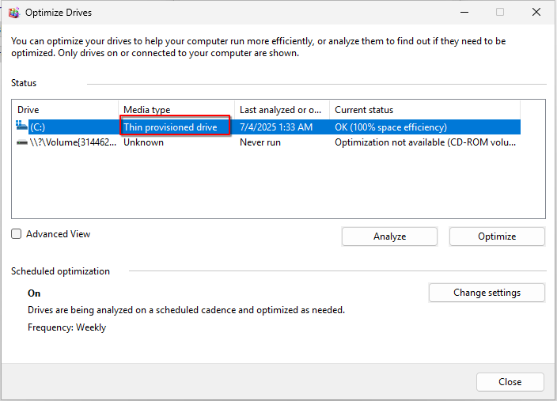
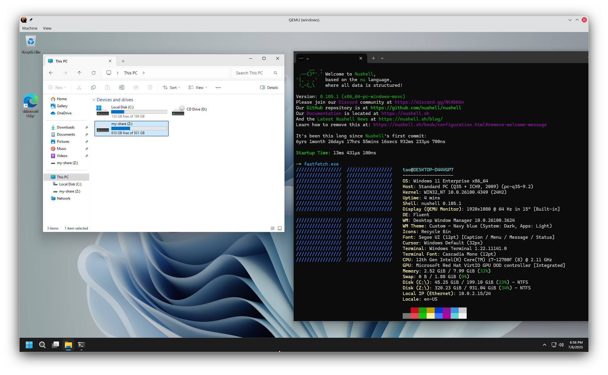

(这只是一个记录贴. 最近又需要在Linux机器上弄一台Windows开发虚拟机, 遂翻出了几年前的记录, 并针对较新的Qemu版本做了一些更新.)

# TL;DR
Qemu命令行参数:
```shell
qemu-system-x86_64 -accel kvm -machine q35 -name windows \
-cpu host,hv_relaxed,hv_spinlocks=0x1fff,hv_vapic,hv_vpindex,hv_synic,hv_time,hv_stimer,hv_tlbflush,hv_tlbflush_ext,hv_ipi,hv_stimer_direct,hv_runtime,hv_frequencies,hv_reenlightenment,hv_avic,hv_xmm_input,hv_evmcs \
-smp sockets=1,cores=8,threads=1 \
-m 8G \
-rtc base=localtime \
-drive if=pflash,format=raw,readonly=on,file=OVMF_CODE.fd -drive if=pflash,format=raw,file=OVMF_VARS.fd \
-device virtio-balloon \
-vga none -device virtio-vga \
# qxl: -device qxl-vga,xres=1920,yres=1080,vgamem_mb=32
-audiodev pipewire,id=snd0 -device ich9-intel-hda -device hda-output,audiodev=snd0 \
-device qemu-xhci,id=xhci -device usb-tablet \
-drive file=disk0.qcow2,if=virtio,discard=unmap \
-nic user,model=virtio-net-pci,guestfwd=tcp::1080-tcp:127.0.0.1:1080 \
# virtiofs share
-object memory-backend-memfd,id=mem,size=8G,share=on -numa node,memdev=mem -chardev socket,id=char0,path=/tmp/vm-share -device vhost-user-fs-pci,chardev=char0,tag=my-share \
# For installing Windows
-drive file=windows.iso,index=2,media=cdrom \
-drive file=virtio-win.iso,index=3,media=cdrom
```

Virtiofsd:
```shell
/usr/libexec/virtiofsd --socket-path=/tmp/virtiofs-share.sock --shared-dir /path/to/shared/dir
```

# 关于Qemu命令行
推荐阅读: https://archive.fosdem.org/2018/schedule/event/vai_qemu_jungle/

Qemu的一些选项经常让新手困惑, 主要原因其实就是:
1. Qemu模拟的每个虚拟设备都由host backend和guest device两部分组成. 两部分一般用一个名字(id)相联系.
诸如`-nic`, `-drive`之类的选项只是为了便利提供的shortcut, 能够同时配置两部分.

    例如, `-nic user,model=virtio-net-pci`的完整写法是`--device virtio-net-pci,netdev=n1 --netdev user,id=n1`

2. Qemu的一个system emulator一般会有一些默认模拟的设备, 即使不加任何命令行参数都会被模拟. 例如, x86的system emulator默认会模拟一个vga显卡等.

# 参数说明

## 芯片组和CPU
x86-64上一般使用q35机型即可.
`-cpu host`表示使用主机的CPU型号, 并且会开启对应的指令集支持. 后面的一串`hv_*`是hyper-v enlightments, 适用于Windows客户机.

用`-smp`选项可指定CPU的拓扑关系, 这里指定一枚CPU, 8个核心, 每个核心有1个线程.

## UEFI固件
利用OVMF提供的edk2固件, 实现UEFI启动. 一般发行版都会打包OVMF固件, 没有的话可以从网上下载.
固件分为只读和可写两部分, 以`pflash`形式添加.

## 显卡
Qemu给x86客机默认模拟的是一个基本的VGA设备, 足以用于Windows客机显示.
除此之外可选的是`virtio-vga`和`qxl-vga`. 前者可选择OpenGL加速(基于API转发, 目前对Windows无效), 后者主要用于给SPICE远程连接.

它们都是兼容VGA的, 在virtio驱动iso里包含对应的驱动. 这些Windows驱动都是DoD(Display only driver)驱动, 没有Windows上的图形加速功能, 用处不大, 功能上和基本的VGA无异.

参看: https://www.kraxel.org/blog/2019/09/display-devices-in-qemu/ (很有价值的blog, 来自qemu开发者)

(如果要求图形性能, 还是需要GPU直通或GPU虚拟化, 目前Qemu中没有虚拟显卡能给Windows客机提供较好的图形加速.
不过, 我们的目的仅是一个Windows开发机, 普通的VGA显示已足够.)

## 声音
主机Backend部分上面选择了pipewire. 此外也可以用pulseaudio等. `-device ich9-intel-hda -device hda-output,audiodev=snd0`添加了两个客机设备, 分别是audio controller和audio codec, 和前面的backend id对应.

## USB, 输入
一些芯片组(包括q35)具有自带的USB支持, 可用`-usb`开启.
但这里我们选择了`qemu-xhci`, qemu实现的一个通用的USB 3.0总线设备.

鼠标输入采用`usb-tablet`.
tablet设备的用处类似于触摸屏, 即Qemu无需grab input, 鼠标划过Qemu显示窗口时, 就自动输入到客机桌面中.

键盘方面, Qemu的x86 system emulator会默认模拟, 不需要手动添加.

## 存储
直接使用一块virtio-scsi硬盘: `-drive file=disk0.qcow2,if=virtio,discard=unmap`

`if=virtio`在较早版本的Qemu上应该是`virtio-blk`驱动.
新版本的Qemu里则默认是`virtio-scsi`总线上的scsi硬盘, 相当于:
```
-drive if=none,id=hd1,format=qcow2,file=disk0.qcow2,discard=unmap
-device scsi-hd,drive=hd1
```
qcow2硬盘镜像可用`qemu-img`自行创建.

### TRIM
`virtio-scsi`以及`virtio-blk`存储设备均支持TRIM指令(即scsi标准中的unmap), 可用`discard=unmap`开启.
通过这种方式, 客机能直接告知主机, 存储中的哪些部分已经不再使用, 可以释放.
在这之前, 常见的老办法是在客机内写入一个全部为0的大文件, 直到把硬盘填满, 再把这个文件删除,
此时硬盘上的空闲空间应该全部是0, 随后将主机上的镜像文件转为稀疏文件.

对于不同的主机存储backend, 收到来自客机的TRIM指令后的处理方式也不同.
对于qcow2和raw镜像文件, Qemu的处理方式是给文件中被trim的空闲部分punch hole, 使之成为稀疏文件, 从而减少镜像文件的实际硬盘占用.
这一点可用`ls -lhs`或`du disk0.qcow2 ; du --apparent-size disk0.qcow2`来验证.

Windows客机在删除文件时会自动trim.
也可以使用自带的硬盘优化工具给硬盘手动trim, 其中虚拟硬盘会被显示为"Thin provisioned drive".



### 安装盘
安装时, 我们需要以cdrom形式添加windows的安装iso, 以及包含virtio windows驱动的iso.
安装过程中, 需要先加载virtio存储驱动, 才能看到硬盘并继续安装.

## 网络
如果在意网络性能, 最好是使用一个由主机上的一个虚拟interface back的tap设备.
简便起见, 这里使用了qemu自带的user-mode networking, 作为主机backend.
客机设备则是virtio网卡, 需要安装对应驱动.

user-mode networking自带了端口转发功能, 两个方向均可. 上面的配置是把客机发向虚拟内网中主机(网关)`1080`端口的tcp包转发到本机的`127.0.0.1:1080`处.

## virtiofs文件共享
目前Qemu上性能最好的共享文件方案就是virtiofs, 它是基于共享内存实现, 性能远高于9pfs或者其它基于网络层的方案.

* 客机部分: Windows上的virtiofs文件系统驱动是用WinFsp实现, 这个相当于Windows上的FUSE, 需要在客机提前安装好.
此外, 需要安装好virtiofs的客机驱动和服务. 这部分可以直接安装virtio驱动iso中的guest工具包.
安装后在services.msc中找到并开启virtiofs服务即可.

* 主机部分: 运行virtiofsd, 指定通讯用socket路径和共享文件路径即可;
在对应的Qemu参数中, 配置好共享内存和socket, 并添加`vhost-user-fs-pci`设备.

## 其它
* `-rtc base=localtime`: 由于Windows默认认为硬件时钟是本地时区. 因此将模拟的硬件时钟设为本地时区. (假设客户机的时区和本机相同)
* `-device virtio-balloon`: ballon设备帮助qemu主进程释放客户机空闲的内存.

# 结果

