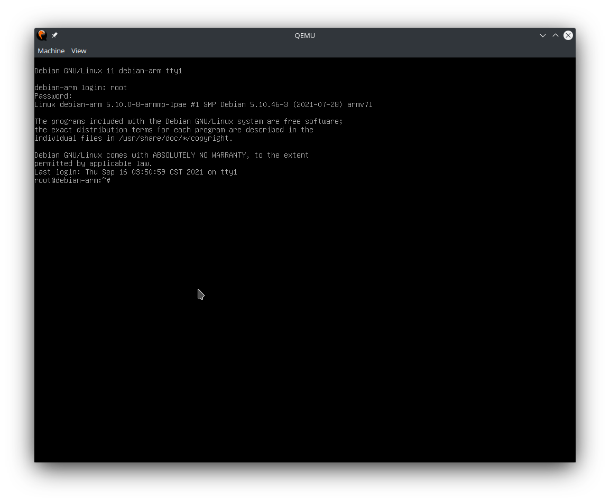

Emulating ARM machines on QEMU hasn't been straight-forward due to lack of a
standardized way to configure the bootloader across different ARM boards. One
had to extract the kernel image, and specify the boot options on the command
line (`-kernel`, `-initrd`), so QEMU knows what to do with its machine-specific
boot code.

We can make things easier with the help of UEFI (namely EDK2, with ARM support), so
installing and booting Linux just works like on a x86 PC target.

# Prerequisites

* QEMU system emulator for ARM.
* EDK2 binaries for ARM. They can be extracted from the debian package
`qemu-efi-arm` or `qemu-efi-aarch64`, depending on your target arch.
* Official Debian installer iso for ARM.

# Booting the installer

> **NOTE:** This example is for arm32

First of all, create a new disk image via `qemu-img`. Copy EDK2 FW binaries
(`AAVMF32_CODE.fd` and `AAVMF32_VARS.fd`, the latter is for hosting volatile
variables) and the installer image to the same directory.

We'll be emulating the `virt` board, which has support for virtio devices:
```text
qemu-system-arm -M virt -m 512M -cpu cortex-a15 \
-device qemu-xhci -device usb-kbd \
-device usb-storage,drive=install -blockdev file,filename=debian-testing-armhf-DVD-1.iso,node-name=install \
-blockdev qcow2,node-name=root,file.driver=file,file.filename=disk0.qcow2 -device virtio-blk-device,drive=root \
-nic user,model=virtio \
-pflash ./AAVMF32_CODE.fd -pflash ./AAVMF32_VARS.fd \
-device ramfb
```

* `-device qemu-xhci -device usb-kbd` attaches a low-overhead USB XHCI bus, and
a USB keyboard. You could add a mouse if needed. Alternatively, on-board USB support is available by passing `-usb`.
* Next two lines attach the installer iso as a USB storage device, and the
rootfs disk as a virtio block device. (I think cdrom is unsupported, no?)
* `-nic user,model=virtio` enables basic user-mode networking, backed by the
virtio NIC.
* `-device ramfb` adds a simple display device, which is just a frambuffer in
guest memory. QEMU ARM system emulator does not emulate a display device by
default. The standard `std` VGA won't work since the installer environment
lacks required DRM kmods. _**Note**_: The serial console is also available.

The guest will now boot into the installer iso. Simply
follow the installation instructions, the grub-efi bootloader will be installed to the EFI firmware automatically.

# Booting the installed system

No additional configuration is required.
Don't forget to attach the UEFI firmware via `-pflash`.
```text
qemu-system-arm -M virt -m 512M -cpu cortex-a15 \
-device qemu-xhci -device usb-kbd \
-blockdev qcow2,node-name=root,file.driver=file,file.filename=disk0.qcow2 -device virtio-blk-device,drive=root \
-nic user,model=virtio \
-pflash ./AAVMF32_CODE.fd -pflash ./AAVMF32_VARS.fd \
-device VGA
```



Voilà! Your new virtual ARM system is ready to go!
