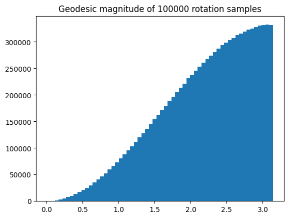

# Intro
The problem of sampling uniformly in the space of 3D rotations arises commonly in the field of robotics, computer vision, compute graphics etc.
The problem is, how do we define "uniform" in the context of rotations?

## Naive solution
A naive method would be sampling the unit rotation axis and the geodesic rotation magnitude separately, both uniformly on $\mathbb{S}^2$ (i.e. The 2-D sphere of a 3-D ball) and $[0, \pi]$.
This will not give a uniform distribution, as there's a straight forward intuition that is
violated by this method.
The intuition is that, a rotation of zero rotation angle should have zero probability (or measure)
in our desired distribution.
At tiny angles, there's not much space for the rotation, beside a little wiggle.
As the rotation angle increases, so does the probability of it.

However, this naive solution would yield equal probability for all rotation angles, violating our intuition.

# The Haar measure
Actually, to sample uniformly over a Lie group such as $SO(3)$, the probability density must correspond to the Haar measure, which represents a uniform distribution of the $SO(3)$ group.

As we know it, the $SU(2)$ group (or equivalently, all unit quaternions, or the $\mathbb{S}^3$ hypersphere) forms a proper *double cover*
over $SO(3)$.
The $SO(3)$ group space is kind of tricky, since it's not simply connected, with a non-trivia loop
of $2\pi$ rotation. The double cover given by unit quaternions unwraps it into a smooth hypersphere,
which is simply connected, and it's volume-preserving.

(Side note: This intrinsic property of $SO(3)$ gives rise to a interesting phenomenon,
where a $2\pi$ rotation is not equivalent to no rotation, but a $4\pi$ rotation is.
This is demonstrated by the [Dirac's string trick](https://en.wikipedia.org/wiki/Plate_trick))

This means we can simply sample uniformly on the space of unit quaternions,
which is also the $\mathbb{S}^3$ hypersphere. It's equivalent to the origin problem.

## Uniform sampling on a unit hypersphere
The problem now has turned into sampling on the $\mathbb{S}^3$ hypersphere.
A straight forward solution would be sampling from a direction-independent distribution,
then normalizing the radius.

A common approach is to sample each coordinate from independent but identical Gaussian distributions.
The probability density would be the product of each Gaussian distribution, which is only
determined by the radius $r$. 
$$
P(\mathbf{x}) = \prod_{i}{\frac{1}{\sqrt{2\pi}} \exp(-\frac{x_i^2}{2})} \propto \exp(-\frac{r^2}{2})
$$
Afterwards, we normalize this vector, to bring it onto the unit sphere, and interpret it as a unit quaternion, mapping it to a 3D rotation.

To see if this distribution aligns with our intuition, we look at it's distribution w.r.t. rotational
magnitude:

Looks like it does.

## Parametric sampling on the hypersphere (Hopf fibration).

There's a another clever way of uniform sampling on the $\mathbb{S}^3$ hypersphere, given by the following
formula:
$$
\mathbf{q} = (\sqrt{1-u_1}\sin(2\pi u_2), \sqrt{1-u_1}\cos(2\pi u_2),
\sqrt{u_1}\sin(2\pi u_3), \sqrt{u_1}\cos(2\pi u_3))
$$
where the parameters $u_1, u_2, u_3 \in [0, 1]$, are drawn from a uniform distribution.

# Library implementations

* `Rotation.random` from [scipy](https://docs.scipy.org/doc/scipy/reference/generated/scipy.spatial.transform.Rotation.random.html).
    * [Uniform sampling in SO(n)](https://docs.scipy.org/doc/scipy/reference/generated/scipy.stats.special_ortho_group.html#scipy.stats.special_ortho_group)

* [Eigen::Quaternion::UnitRandom](https://eigen.tuxfamily.org/dox/classEigen_1_1Quaternion.html#a7da87cda5567ff1e860782d638643868)

* [Sophus::SO3::sampleUniform](https://github.com/strasdat/Sophus/blob/d0b7315a0d90fc6143defa54596a3a95d9fa10ec/sophus/so3.hpp#L855)

# Related problem: Uniform sampling inside unit ball

A related, but not equivalent problem is sampling inside the unit ball.

Reject sampling in a bounding cube should work for lower dimensions. In high dimensions where most volume is concentrated in the reject region, rejection rate is too high for it to be useful.

An approach without relying on rejection is to generate a random direction (which we already covered),
then normalize the radius parameter.

For the n-dimensional unit ball, the direction is given by sampling on its surface, i.e. $\mathbb{S}^{n-1}$. The radius is drawn from the uniform distribution $U \in [0, 1]$, then normalized to account for the volume element, that is: $r = U^{1/n}$.

# References
1. Sim, Robert, and Gregory Dudek. "Learning generative models of scene features." International Journal of Computer Vision 60 (2004): 45-61.

2. Alexa, Marc. "Super-fibonacci spirals: Fast, low-discrepancy sampling of so (3)." Proceedings of the IEEE/CVF Conference on Computer Vision and Pattern Recognition. 2022.

3. https://mathworld.wolfram.com/HyperspherePointPicking.html
